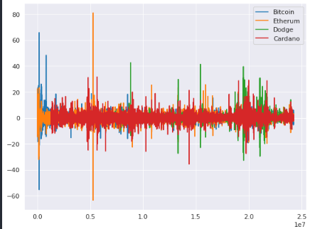

### G-Research Crypto Forecasting Competition

This repository contains my attempt at the [G-Research Crypto Forecasting](https://www.kaggle.com/c/g-research-crypto-forecasting) competition on Kaggle.

# Data Structure

- The training dataset has timestamp, Asset_ID, Count, Open, Close, High, Low, Volume, VWAP, Target colummns. Where Target is to be predicted. 
- They are missing values within the Target column.


## Time-Series Traits

There some extreme cycles in cryptocurrency market that causes drastic change in market caps and prices. But in order to be able to see if major coins follow these trend/seasonality cycles or not, I got the z-score for each Target (seperated by coin) then graphed the z-scores.

```python
plt.figure(figsize=(8, 6), dpi=80)

plt.plot(btc['target_z'], label='Bitcoin')
plt.plot(eth['target_z'], label='Etherum')
plt.plot(dog['target_z'], label='Dodge')
plt.plot(ada['target_z'], label='Cardano')

plt.legend()
plt.show()
```



Observing this graph tells us that there is some correlation between ups and downs of all graph. They all go up and down together (for major changes) but still they are some changes in each individual coin that does not follow others' changes.

- The unique changes for each coin might correspond to endorsments (Elon Musk's tweets about Dodge) and major development peaks (or something else).
- These unique changes can be seen as short-term trend for each coin.
- But the changes that are seen in all of the coins at the same can be seen as a general seasonality.

## Working on

**Train, Test, Validation splits**: Before subtracting the seasonality, data should be sliced based on a consecutive sequence, ie the split can not be done at random due to the data structure (being sequential).


**Subtracting the seasonality and trend from the data**: By taking the seasonality and trend out of the picture, the target can be treated as a simple regression model (and then the seasonality/trend can be added) meaning that the data would not be considered sequential anymore:
- Try multiple deseasonings and try to see if they work on the model or not.

**Feature Engineering**: They are number of features that are being added but probably not all of them are helpful
- Some features and normalization should be done for each coin seperately
- The idea is to seperate coins based on asset_id then merge.
- While seperated some features will be added.

**Reducing size**: Some values within columns are really large and that is why a specific data type is used for those columns but after normalizing the data, the type can be changed since values will be scaled to a shorter range.